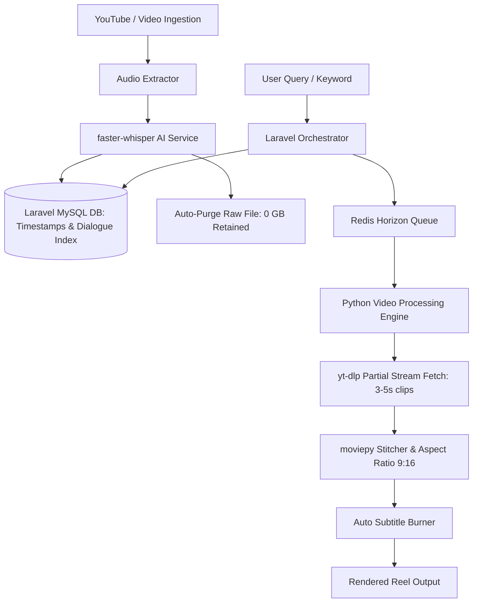

# 🎬 AI Reels Generator (Microservices Architecture)

[](https://laravel.com)
[](https://php.net)
[](https://filamentphp.com)
[](https://python.org)
[](https://fastapi.tiangolo.com)
[](https://docker.com)
[](https://laravel.com/docs/horizon)
[](https://github.com/SYSTRAN/faster-whisper)

> **An automated, zero-storage microservices platform that extracts vocabulary timestamps from long-form videos using AI Speech-to-Text and generates 9:16 vertical shorts/reels on demand.**

---

## 🌟 Key Highlights & System Architecture

### 💡 The "Zero-Storage Smart Partial Ingestion" Problem & Solution
* **The Problem:** Downloading and retaining hundreds of full-length movies on the server causes exponential disk storage costs and bandwidth bottlenecks.
* **The Solution:** 
  1. Temporary ingestion pipeline downloads the audio stream.
  2. `faster-whisper` extracts complete dialogues with precise timestamps (word-level precision) and indexes them into MySQL.
  3. The raw video/audio file is **immediately purged** (Zero Server Storage).
  4. When a user requests a reel for a specific word, phrase, or emotion, the system leverages `yt-dlp --download-sections` to fetch **only the required 3–5 second clip** on demand and stitches them using `moviepy`.



---

## 🚀 Tech Stack

| Domain | Technologies |
| :--- | :--- |
| **Backend Orchestrator** | Laravel 13.x, PHP 8.3+, Filament v5, RESTful APIs, Eloquent ORM |
| **Queue & Concurrency** | Redis, Laravel Horizon (Asynchronous Distributed Jobs) |
| **AI & NLP Engine** | Python 3.11, `faster-whisper`, CEFR Word-Level Classifier (Jupyter) |
| **Video Processing** | `moviepy`, `ffmpeg`, `yt-dlp` |
| **DevOps & Infrastructure** | Docker, Docker Compose, Nginx, Multi-container Networking |
| **Frontend UI** | Modern React + Tailwind CSS Dashboard |

---

## 📦 Multi-Container Docker Architecture

The entire microservice ecosystem runs fully containerized via `docker-compose`:

* `ai_reels_app`: Laravel application backend runtime.
* `ai_reels_horizon`: Dedicated container for background queue workers & job dispatching.
* `ai_reels_python_api`: Dedicated Python AI microservice running Whisper & video processing logic.
* `ai_reels_nginx`: High-performance reverse proxy.
* `ai_reels_mysql`: Relational data store for timestamp indexes and vocabulary metadata.
* `ai_reels_redis`: High-throughput caching and queue broker for distributed tasks.

---

## 🛠️ Quickstart (Local Development)

### 1. Clone the repository
```bash
git clone https://github.com/kaziomarSH24/ai-reels-mas.git
cd ai-reels-mas
```

### 2. Environment Configuration
```bash
cp .env.example .env
```

### 3. Spin up with Docker Compose
```bash
docker compose up -d --build
```

### 4. Run Migrations & Dependencies
```bash
docker compose exec app composer install
docker compose exec app php artisan key:generate
docker compose exec app php artisan migrate
```

Visit the application at: `http://localhost:8000`  
Monitor background queues via Laravel Horizon: `http://localhost:8000/horizon`

---

## 🔬 NLP & Vocabulary Intelligence
* Includes an experimental **CEFR (Common European Framework of Reference) Word-Level Classifier** trained on subtitle datasets to categorize dialogues by difficulty (A1–C2).
* Notebooks and metrics graph available in `cefr-word-level-classifier.ipynb` and `notebook-nlp/`.

---

## 👨‍💻 Author

**Kazi Omar Faruk**  
*Full Stack / Backend Engineer*  
* [LinkedIn](https://www.linkedin.com/in/kaziomarsh24/)  
* [Portfolio](https://kaziomar.vercel.app/)  
* [GitHub](https://github.com/kaziomarSH24)
